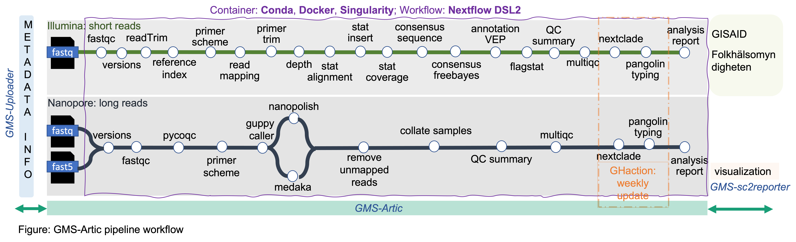

A nextflow pipeline with a GMS touch for running the ARTIC network's fieldbioinformatics tools (https://github.com/artic-network/fieldbioinformatics).

### Table of contents - 
- [Version updates](#Version-updates)
- [Pipeline Diagram](#Pipeline-Diagram)
- [Quick start guide](#Quick-Start-Guide)
  - [parameters setup](#Parameters-setup)
  - [Test Data](#Test-Data)
  - [Run on local server](#-Run-on-local-server)
    - [Requirements](#Requirements)
    - [Illumina pipeline](#Illumina-pipeline)
    - [Nanopore nanopolish pipeline](#Nanopore-nanopolish-pipeline)
    - [Nanopore medaka pipeline](#Nanopore-medaka-pipeline)
  - [How to run in NGP server](#How-to-run-in-NGP-server)
    - [Datafile structure](#Datafile-structure)
    - [Pipeline run command](#Manual-running-of-analysis-pipeline)
      - [Illumina pipeline](#Run-Illumina-pipeline)
      - [Nanopore pipeline](#Run-Nanopore-Pipeline)
- [Useful information](#Useful-information) 
------------
# Version updates
## v2.0.0
### Major updates
- Docker container separated for Pangolin typing -
    - Illumina container: [gms-artic-illumina](https://hub.docker.com/repository/docker/genomicmedicinesweden/gms-artic-illumina)
    - Nanopore container: [gms-artic-nanopore](https://hub.docker.com/repository/docker/genomicmedicinesweden/gms-artic-nanopore)
    - Pangolin container: [gms-artic-pangolin](https://hub.docker.com/repository/docker/genomicmedicinesweden/gms-artic-pangolin)
    - pycoQC container  : [pycoqc](https://hub.docker.com/repository/docker/jd21/pycoqc)
- Added separate package version files for each workflow 
    - versions: for Illumina and Nanopore
    - pangoversion: for pangolin typing
- Illumina analysis additional features -
    - flagstat
    - depth
    - VEP annotation
- Illumina results works for sc2reporter visualization
- Nanopore analysis additional features (artic & medaka)-
    - [fastqc](https://github.com/s-andrews/FastQC)
    - [multiqc](https://multiqc.info)
    - [pycoQC](https://github.com/a-slide/pycoQC) *(only for artic)*

## v1.8.0
### Minor updates

- Pangolin v4 support
- Updated Picard arguments
- FastQC commands can be added from config
- Added version of pangolin to build_dockerfile

### Bug fixes
- Fixed build_dockerfile
- Fixed R issue
- Fixed mamba issue

### Major changes
* The illumina and nanopore tracks automatically run pangolin and nextclade.
* Generates report for base changes.

# Pipeline Diagram


Find DAG and other figures [here](workflow-image/)

# Quick Start Guide
## Test Data
To test the pipeline, an [example dataset](./.github/data) for both Illumina and Nanopore (nanopolish, medaka) datafiles (from ConnerLab) provided.

# parameters setup
## primer scheme
##### --scheme: To use the primer list, add --scheme to the CLI, eg., use 'nCoV-2019/V3' for artic primers or 'midnight-primer/V1'

```
--scheme nCoV-2019/V3/
--scheme midnight-primers/V1/
--scheme eden-primers/V1/
```
**To run the artic pipeline, please change the [nanopore.config](https://github.com/JD2112/gms-artic/blob/master/conf/nanopore.config) 'min_length' (default = 400) and 'max_length' (default = 700)**

**For more parameters setup, please see the [ConnerLab documentation](ConnerLab-README.md)**

## Run on local server
### Requirements
1. Containers: [Singularity](https://singularity-tutorial.github.io/01-installation/), [Docker](https://docs.docker.com/engine/install/)
2. [Nextflow>=20](https://www.nextflow.io/docs/latest/getstarted.html)

### Illumina pipeline
```
nextflow run main.nf -profile singularity \
    --illumina --prefix "test_illumina"     \
    --directory .github/data/fastqs/    \
    --outdir illumina_test
```
### Nanopore nanopolish pipeline
```
nextflow run main.nf -profile singularity \
    --nanopolish --prefix "test_nanopore_nanopolish" \
    --basecalled_fastq .github/data/nanopore/20200311_1427_X1_FAK72834_a3787181/fastq_pass/ \
    --fast5_pass .github/data/nanopore/20200311_1427_X1_FAK72834_a3787181/fast5_pass/ \
    --sequencing_summary .github/data/nanopore/20200311_1427_X1_FAK72834_a3787181/sequencing_summary_FAK72834_298b7829.txt \
    --outdir nanopore_nanopolish
```
#### Nanopore medaka pipeline
```
nextflow run main.nf -profile singularity \
    --medaka --prefix "test_nanopore_medaka" \
    --basecalled_fastq .github/data/nanopore/20200311_1427_X1_FAK72834_a3787181/fastq_pass/ \
    --outdir nanopore_medaka
```

## Run on NGP server
### Datafile structure
1. *for Nanopore analysis (default is "midnight")*
```
    sample_name
         |___ fast5_pass/
         |___ fastq_pass/
         |___ sequencing_summary.txt
```
#### Run Nanopolish pipeline
```
nextflow run main.nf -profile singularity,sge \
    --nanopolish --prefix "test_nanopore" \
    --basecalled_fastq .github/data/nanopore/20200311_1427_X1_FAK72834_a3787181/fastq_pass/ \
    --fast5_pass .github/data/nanopore/20200311_1427_X1_FAK72834_a3787181/fast5_pass/ \
    --sequencing_summary .github/data/nanopore/20200311_1427_X1_FAK72834_a3787181/sequencing_summary_FAK72834_298b7829.txt \
     --outdir nanopore_test
```

#### Run medaka pipeline
```
nextflow run main.nf -profile singularity,sge \
    --medaka --prefix "test_nanopore_medaka" \
    --basecalled_fastq .github/data/nanopore/20200311_1427_X1_FAK72834_a3787181/fastq_pass/ \
    --outdir nanopore_medaka
```
2. *for Illumina analysis*
```
    sample_name     
         |___ fastq/
```
#### Run Illumina pipeline
```
nextflow run main.nf -profile singularity,sge \
    --illumina --prefix "test_illumina"     \
    --directory .github/data/fastqs/    \
    --outdir illumina_test
```


# Useful information
1.To update your container image to the latest version from [dockerhub](https://hub.docker.com/orgs/genomicmedicinesweden/repositories), please delete your local image first before running the analysis pipeline.